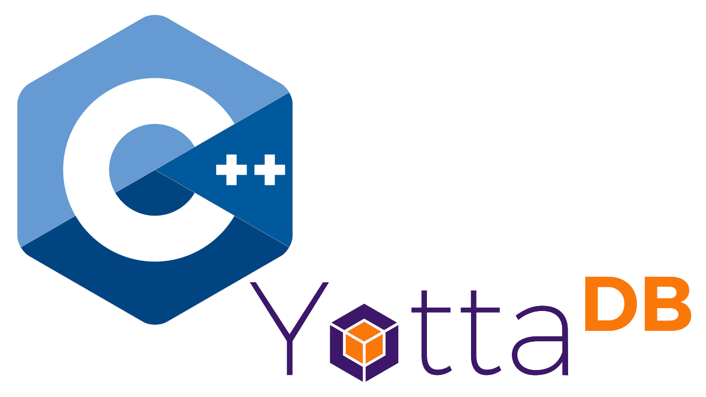

# YottaDB-Database-Connector for C++

This class allows access to YottaDB-trees (persistent and in-memory) like accessing a C++-tree (multidimensional array).
```cpp	
_global[1][2]["foo"] = "bar";
cout << _global[1][2]["foo"]
```

# Prerequisites
YottaDB hierarchical NoSQL-database  [https://yottadb.com/](https://yottadb.com/)	
# Best Practise
If using named objects name the object like the global (but with a preceding underscore instead of caret).
Mapping an object to the global name is done via the constructor.
```cpp	
c_ydb_global _g("^g"), _counter("^counter");
```
# Error Processing
If a second parameter in the constructor is passed as 1 the object throws errors (see test2.cpp).
If the second parameter is passed as 0 (or omitted) error-processing is done by the method int rc(); which
can be called after each access.
# License

This project is licensed under the terms of the MIT license.